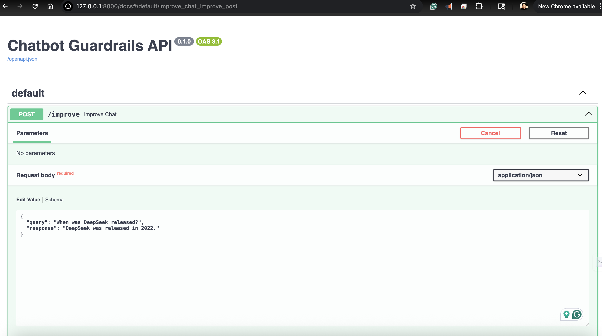
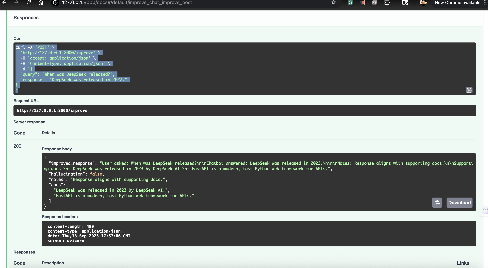

# 🤖 Chatbot Guardrails

A lightweight plugin to **reduce hallucinations** and **add fact-checking** to LLM/chatbot responses using **RAG (Retrieval-Augmented Generation)**.

---

## 🚀 Features
- ✅ Intercepts chatbot responses before returning to user  
- ✅ RAG with FAISS + SentenceTransformers  
- ✅ Flags hallucinations if response doesn’t align with retrieved docs  
- ✅ Easy API wrapper with FastAPI  
- ✅ Deploy anywhere with Docker  

---

## 📂 Project Structure
chatbot-guardrails/
├── src/chatbot_guardrails/ # Core package
├── examples/ # Demo usage
├── tests/ # Unit tests
├── Dockerfile # Container build
├── docker-compose.yml # Optional orchestrator
├── requirements.txt
├── setup.py
└── README.md


---

## ⚡ Quick Start

### 1. Clone & Install
```bash
git clone https://github.com/mishuhaque/chatbot-guardrails.git
cd chatbot-guardrails
pip install -r requirements.txt


uvicorn src.chatbot_guardrails.api:app --reload
Visit Swagger UI: http://127.0.0.1:8000/docs

🐳 Run with Docker

1. Build Image
docker build -t chatbot-guardrails .


2. Run Container
docker run -p 8000:8000 chatbot-guardrails


Now open http://127.0.0.1:8000/docs

📡 Example Request
cURL
curl -X POST "http://127.0.0.1:8000/improve" \
-H "Content-Type: application/json" \
-d '{"query":"When was DeepSeek released?", "response":"DeepSeek was released in 2022."}'


Response
{
  "improved_response": "User asked: When was DeepSeek released?...",
  "hallucination": true,
  "notes": "No supporting evidence found.",
  "docs": [
    "DeepSeek was released in 2023 by DeepSeek AI.",
    "ChatGPT is developed by OpenAI."
  ]
}


🧪 Tests

Run unit tests with:
pytest tests/

## 📸 Screenshots

### Swagger UI


### Example Request

